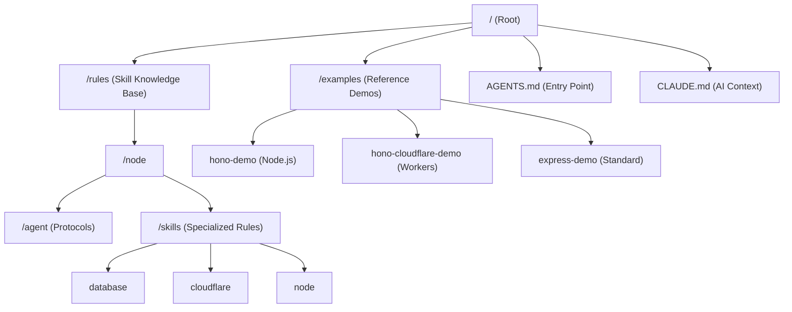

# Project Structure

This document provides a high-level map of the `skills` repository.

## 🗺️ Visual Map

## 📂 Detailed Directory Overview

### `/rules/node/`
- **`AGENTS.md`**: The master instruction file for AI agents.
- **`SKILL.md`**: The index of all available skills.
- **`agent/`**: Contains core interaction protocols, documentation standards, and testing flows.
- **`skills/`**: Domain-specific rules (Database, ORM, Cloudflare, Node patterns, etc.).

### `/examples/`
- **`hono-demo`**: Demonstrates the modular architecture in a standard Node.js environment using Hono.
- **`hono-cloudflare-demo`**: Demonstrates the modular architecture optimized for Cloudflare Workers (D1, KV, R2).
- **`express-demo`**: A reference for traditional Express.js applications using the same modular principles.

## 🔑 Key Patterns
1. **Modularity**: Everything is organized by feature/module.
2. **Type Safety**: Heavy reliance on TypeScript and Zod.
3. **AI-Ready**: The repo is optimized for AI assistance via structured rule files.
